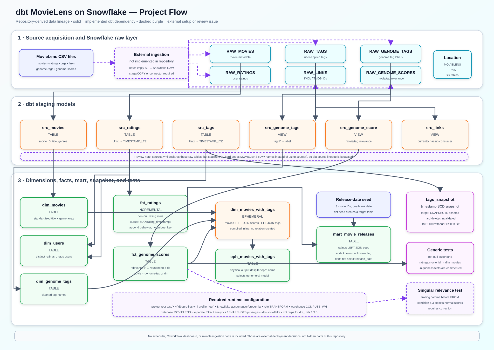

# dbt MovieLens on Snowflake

This repository is a standalone dbt project that transforms the MovieLens dataset in Snowflake. It expects six preloaded raw tables, builds staging models, dimensions, facts, a movie-release mart, an ephemeral movie/tag join, and a slowly changing snapshot of user tags. It also includes a small seed and a set of generic and singular data tests.

The active dbt project is inside the `test/` directory. Despite its name, `test/` is the project root—not only a test folder.

> [!IMPORTANT]
> Raw data ingestion, scheduling/orchestration, CI/CD, and dashboarding are not implemented in this repository. The checked-in notes imply an S3-to-Snowflake raw load, but no stage, storage integration, `COPY INTO`, Airflow DAG, dbt Cloud Job, or CI workflow is included.

## Architecture

[Download the PNG flowchart](docs/project-flowchart.png) · [Full-size SVG](docs/project-flowchart.svg) · [Editable Mermaid source](docs/project-flowchart.mmd)



Solid arrows show implemented dbt dependencies. Dashed purple elements identify external setup or a code path that needs review.

## What the project does

1. Reads six MovieLens raw tables from `MOVIELENS.RAW`.
2. Renames source columns and converts rating/tag Unix timestamps to Snowflake `TIMESTAMP_LTZ` values.
3. Builds movie, user, and genome-tag dimensions.
4. Builds an incremental ratings fact using the maximum loaded rating timestamp as its cursor.
5. Builds a movie/genome-tag relevance fact.
6. Creates an ephemeral movie/tag join and exposes it through a downstream physical table.
7. Seeds three movie release dates and labels rating rows as having a known or unknown release date.
8. Snapshots a limited set of user tags using dbt's timestamp strategy.
9. Runs generic not-null/relationship checks and a custom relevance-score test.

## Data lineage and materializations

```text
MOVIELENS.RAW.RAW_MOVIES ─> src_movies [table] ─> dim_movies [table]
                                                     └──────────────┐
MOVIELENS.RAW.RAW_GENOME_TAGS ─> src_genome_tags [view]            │
                                  └> dim_genome_tags [table] ───────┤
                                                                    ├─> dim_movies_with_tags [ephemeral]
MOVIELENS.RAW.RAW_GENOME_SCORES ─> src_genome_score [view]         │       └> eph_movies_with_tags [table]
                                    └> fct_genome_scores [table] ───┘

MOVIELENS.RAW.RAW_RATINGS ─> src_ratings [table] ─> fct_ratings [incremental]
                                  │                       └> mart_movie_releases [table] <─ release-date seed
                                  └> dim_users [table]

MOVIELENS.RAW.RAW_TAGS ─> src_tags [table] ─┬─> dim_users [table]
                                             └─> tags_snapshot [snapshot]

MOVIELENS.RAW.RAW_LINKS ─> src_links [view; currently unused]
```

### Staging models

| Model | Materialization | Input | Purpose |
|---|---|---|---|
| `src_movies` | Table | `RAW_MOVIES` | Renames movie ID and selects title/genres. |
| `src_ratings` | Table | `RAW_RATINGS` | Renames keys and converts Unix time to `TIMESTAMP_LTZ`. |
| `src_tags` | Table | `RAW_TAGS` | Renames keys and converts tag time to `TIMESTAMP_LTZ`. |
| `src_genome_tags` | View | `RAW_GENOME_TAGS` | Renames genome-tag ID and label. |
| `src_genome_score` | View | `RAW_GENOME_SCORES` | Renames movie/tag keys and relevance. |
| `src_links` | View | `RAW_LINKS` | Renames MovieLens/IMDb/TMDB identifiers; currently unused downstream. |

`dbt_project.yml` defaults all models to views, while individual configs override the first three staging models to tables.

### Dimensions, facts, and mart

| Model | Materialization | Grain and behavior |
|---|---|---|
| `dim_movies` | Table | One intended row per movie, standardized title and Snowflake genre array. |
| `dim_users` | Table | Distinct union of user IDs seen in ratings or tags. |
| `dim_genome_tags` | Table | One intended row per genome tag with a standardized label. |
| `fct_ratings` | Incremental | Rating events with non-null scores; new rows require a timestamp greater than the current maximum. |
| `fct_genome_scores` | Table | Positive movie/tag relevance values rounded to four decimal places. |
| `dim_movies_with_tags` | Ephemeral | Left-joins movies, relevance scores, and tag labels; compiled into consumers rather than created physically. |
| `eph_movies_with_tags` | Table | Physical copy of the ephemeral join, despite its `eph_` name. |
| `mart_movie_releases` | Table | Rating-level rows plus a `known`/`unknown` release-date flag. |

### Seed and snapshot

- `seeds_movies_release_dates.csv` contains three movie IDs. Movie 3 has no release date.
- `mart_movie_releases` uses the seed only to create `release_date_info`; it does not select the actual release date into the output.
- `tags_snapshot` uses `(user_id, movie_id, tag)` as its key, `tag_timestamp` as `updated_at`, and invalidates hard deletes in the `SNAPSHOTS` schema.
- The snapshot currently uses `LIMIT 100` without `ORDER BY`, so its input set is non-deterministic and rows can appear deleted merely because a different set of 100 rows was returned.

## Repository layout

```text
.
├── README.md                         # Project documentation
├── docs/
│   ├── project-flowchart.svg         # Downloadable architecture image
│   └── project-flowchart.mmd         # Editable Mermaid source
├── logs/dbt.log                      # Tracked local dbt log
├── notes.txt                         # Original setup/learning notes
└── test/                             # Actual dbt project root
    ├── dbt_project.yml
    ├── packages.yml                  # dbt_utils 1.3.0
    ├── models/
    │   ├── staging/
    │   ├── dim/
    │   ├── fact/
    │   ├── mart/
    │   ├── sources.yml
    │   └── schema.yml
    ├── seeds/seeds_movies_release_dates.csv
    ├── snapshots/tags_snapshot.sql
    └── tests/relevance_score_test.sql
```

## Required configuration

### 1. Local tools

Install:

- Python supported by your selected dbt version
- `dbt-snowflake`
- Git, because `dbt deps` retrieves `dbt_utils`
- Access to a Snowflake account

There is no committed `requirements.txt`, so the Python/dbt adapter version is not reproducible. The tracked log shows dbt and the Snowflake adapter at 1.12.0 during earlier local setup; pin a tested version before using this in CI or production.

### 2. Python environment

From the repository root in PowerShell:

```powershell
py -m venv .venv
.\.venv\Scripts\Activate.ps1
python -m pip install --upgrade pip
pip install dbt-snowflake
```

The order matters: create and activate the virtual environment before installing dbt. The original `notes.txt` lists an installation command before environment creation.

### 3. Snowflake profile

The dbt project expects a profile named exactly `test`. Create `%USERPROFILE%\.dbt\profiles.yml` on Windows or `~/.dbt/profiles.yml` on macOS/Linux.

Use environment variables rather than storing a password in the file:

```yaml
test:
  target: dev
  outputs:
    dev:
      type: snowflake
      account: "{{ env_var('SNOWFLAKE_ACCOUNT') }}"
      user: "{{ env_var('SNOWFLAKE_USER') }}"
      password: "{{ env_var('SNOWFLAKE_PASSWORD') }}"
      role: TRANSFORM
      database: MOVIELENS
      warehouse: COMPUTE_WH
      schema: ANALYTICS
      threads: 4
      client_session_keep_alive: false
```

Required environment secrets/settings:

| Name | Secret? | Purpose |
|---|---|---|
| `SNOWFLAKE_ACCOUNT` | No, but account-specific | Snowflake account identifier. |
| `SNOWFLAKE_USER` | Usually not secret | Dedicated dbt service user. |
| `SNOWFLAKE_PASSWORD` | **Yes** | Password for the current authentication method. |
| Snowflake private key/passphrase | **Yes**, if used | Alternative key-pair authentication; update the profile accordingly. |
| OAuth client secret/token | **Yes**, if used | Alternative OAuth authentication; update the profile accordingly. |

No application access token is referenced by the repository itself. AWS credentials are needed only if you implement the missing S3 ingestion path; prefer a Snowflake storage integration/IAM role instead of embedding AWS access keys in dbt or SQL.

Earlier `dbt.log` entries used account `CDGSSOH-KW33241`, user `dbt`, database `MOVIELENS`, warehouse `COMPUTE_WH`, role `TRANSFORM`, and schema `RAW`. They also record a failed login caused by an incorrect username or password. Replace credentials in your local profile and run `dbt debug`; no password is present in the repository log.

### 4. Snowflake databases, schemas, and role grants

The SQL models hard-code raw reads from `MOVIELENS.RAW`. Use a separate target such as `MOVIELENS.ANALYTICS` so transformed objects do not mix with raw ingestion tables. The snapshot independently targets `MOVIELENS.SNAPSHOTS`.

A representative administrator-run setup is:

```sql
CREATE DATABASE IF NOT EXISTS MOVIELENS;
CREATE SCHEMA IF NOT EXISTS MOVIELENS.RAW;
CREATE SCHEMA IF NOT EXISTS MOVIELENS.ANALYTICS;
CREATE SCHEMA IF NOT EXISTS MOVIELENS.SNAPSHOTS;

CREATE WAREHOUSE IF NOT EXISTS COMPUTE_WH
  WAREHOUSE_SIZE = 'XSMALL'
  AUTO_SUSPEND = 60
  AUTO_RESUME = TRUE;

CREATE ROLE IF NOT EXISTS TRANSFORM;
GRANT USAGE ON WAREHOUSE COMPUTE_WH TO ROLE TRANSFORM;
GRANT USAGE ON DATABASE MOVIELENS TO ROLE TRANSFORM;
GRANT USAGE ON SCHEMA MOVIELENS.RAW TO ROLE TRANSFORM;
GRANT SELECT ON ALL TABLES IN SCHEMA MOVIELENS.RAW TO ROLE TRANSFORM;
GRANT SELECT ON FUTURE TABLES IN SCHEMA MOVIELENS.RAW TO ROLE TRANSFORM;

GRANT USAGE ON SCHEMA MOVIELENS.ANALYTICS TO ROLE TRANSFORM;
GRANT CREATE TABLE, CREATE VIEW ON SCHEMA MOVIELENS.ANALYTICS TO ROLE TRANSFORM;
GRANT USAGE ON SCHEMA MOVIELENS.SNAPSHOTS TO ROLE TRANSFORM;
GRANT CREATE TABLE ON SCHEMA MOVIELENS.SNAPSHOTS TO ROLE TRANSFORM;

GRANT ROLE TRANSFORM TO USER YOUR_DBT_USER;
```

Adjust names and grants to your organization's standards. Do not run dbt using `ACCOUNTADMIN`.

### 5. Raw MovieLens tables

Load these relations before running dbt:

| Relation | Required columns used by models |
|---|---|
| `MOVIELENS.RAW.RAW_MOVIES` | `movieId`, `title`, `genres` |
| `MOVIELENS.RAW.RAW_RATINGS` | `userId`, `movieId`, `rating`, `timestamp` |
| `MOVIELENS.RAW.RAW_TAGS` | `userId`, `movieId`, `tag`, `timestamp` |
| `MOVIELENS.RAW.RAW_GENOME_TAGS` | `tagId`, `tag` |
| `MOVIELENS.RAW.RAW_GENOME_SCORES` | `movieId`, `tagId`, `relevance` |
| `MOVIELENS.RAW.RAW_LINKS` | `movieId`, `imdbId`, `tmdbId` |

The repository does not download MovieLens or create/load these tables. A production ingestion design commonly uses a Snowflake storage integration, external stage, file format, and `COPY INTO`, or a managed ingestion tool. Keep ingestion credentials outside this repository.

### 6. dbt package dependency

The project pins `dbt-labs/dbt_utils` to `1.3.0` and uses `generate_surrogate_key` in the tag snapshot. Install it from the project directory:

```powershell
cd test
dbt deps
```

## Run the project

From `test/`, validate connectivity and build dependencies in this order:

```powershell
dbt debug
dbt deps
dbt seed
dbt run
dbt test
dbt snapshot
```

Or use dbt's dependency-aware build command:

```powershell
dbt build
```

Common targeted commands:

```powershell
dbt run --select src_movies+
dbt run --select fct_ratings
dbt run --select +eph_movies_with_tags
dbt test --select fct_ratings
dbt snapshot --select tags_snapshot
dbt run --full-refresh --select fct_ratings
```

Generate documentation and inspect the lineage graph:

```powershell
dbt docs generate
dbt docs serve
```

This repository has no scheduler. To run periodically, add a dbt Cloud Job, Airflow DAG, CI schedule, or another orchestrator and store Snowflake credentials in that platform's secret manager.

## Expected target objects

With the example profile, dbt creates models/seeds in `MOVIELENS.ANALYTICS` and the snapshot in `MOVIELENS.SNAPSHOTS`:

- `SRC_MOVIES`, `SRC_RATINGS`, `SRC_TAGS`
- `SRC_GENOME_TAGS`, `SRC_GENOME_SCORE`, `SRC_LINKS`
- `DIM_MOVIES`, `DIM_USERS`, `DIM_GENOME_TAGS`
- `FCT_RATINGS`, `FCT_GENOME_SCORES`
- `EPH_MOVIES_WITH_TAGS`
- `MART_MOVIE_RELEASES`
- `SEEDS_MOVIES_RELEASE_DATES`
- `MOVIELENS.SNAPSHOTS.TAGS_SNAPSHOT`

`DIM_MOVIES_WITH_TAGS` is ephemeral and therefore does not create a Snowflake relation.

## Known limitations and review findings

- **The singular relevance test needs correction.** It contains a trailing comma before `FROM`, which may produce a compilation/database syntax error. More importantly, it fails on `relevance_score <= 3`; MovieLens relevance scores normally fall between 0 and 1, so the query selects nearly every valid row. A likely intended invalid-row predicate is `relevance_score < 0 OR relevance_score > 1`.
- **The incremental config key is misspelled.** `fct_ratings.sql` uses `on_schema_changes`; dbt's configuration is `on_schema_change` (singular).
- **The ratings incremental strategy can miss data.** It accepts only timestamps strictly greater than the current maximum, has no `unique_key`, and therefore does not update corrected rows or capture late-arriving records with older/equal timestamps.
- **Staging bypasses declared dbt sources.** `sources.yml` defines six sources, but staging SQL hard-codes `MOVIELENS.RAW.RAW_*`. Replace those names with `source('test', '...')` to restore source lineage, source tests, environment portability, and source freshness support.
- **Key uniqueness tests are disabled.** Unique tests for movie, user, and genome-tag dimensions are commented out. This weakens grain guarantees used by downstream joins.
- **Relationship coverage is incomplete.** Ratings validate `movie_id` against `dim_movies`, but user IDs, genome-score movie IDs, and genome-score tag IDs have no relationship tests.
- **The tag snapshot samples arbitrary rows.** `LIMIT 100` without ordering makes the snapshot non-deterministic and conflicts with hard-delete invalidation. Remove the limit for production or use a stable development filter.
- **`row_key` is generated but not used as the snapshot key.** The snapshot instead uses the three-column list. Pick one consistent key strategy.
- **The release mart is rating-grained and omits the release date.** Its name suggests a movie-release mart, but it returns every rating plus only a known/unknown flag. The seed contains only three movies and one blank date.
- **`src_links` is unused.** IMDb and TMDB identifiers are staged but never joined into dimensions or marts.
- **Naming is misleading.** `dim_movies_with_tags` is ephemeral, while `eph_movies_with_tags` is physically materialized as a table.
- **Transformed objects previously targeted `RAW`.** The tracked profile log shows schema `RAW`, which would mix dbt outputs with ingestion tables. Use a separate analytics schema.
- **The tracked log exposes environment metadata.** `logs/dbt.log` is version-controlled and includes a Snowflake account identifier, username, role, warehouse, database, schema, local profile path, adapter version, and failed-login details. Remove it from tracking and add root-level log rules before future runs.
- **Dependencies are not fully reproducible.** `dbt_utils` is pinned, but `dbt-snowflake` and Python dependencies are not captured in a requirements/lock file.
- **There is no orchestration or CI.** Builds, tests, snapshots, and documentation generation must currently be run manually.

## Security notes

- Never commit `profiles.yml`, passwords, private keys, OAuth tokens, AWS access keys, or Snowflake key-pair passphrases.
- Prefer a dedicated service user with the `TRANSFORM` role and least-privilege access.
- For S3 ingestion, prefer a Snowflake storage integration backed by an IAM role over long-lived access keys.
- Remove generated logs from source control if they contain account metadata, query text, or local paths.
- Rotate any credential that may previously have been shared or committed, even if it is no longer visible in the current tree.

## Validation checklist

- [ ] Virtual environment is active and `dbt --version` shows the Snowflake adapter.
- [ ] The `test` profile exists and `dbt debug` succeeds.
- [ ] `TRANSFORM` can use `COMPUTE_WH` and read all six raw tables.
- [ ] `TRANSFORM` can create models in the target analytics schema and snapshots in `SNAPSHOTS`.
- [ ] All required raw MovieLens columns exist with compatible types.
- [ ] `dbt deps` installs `dbt_utils` 1.3.0.
- [ ] `dbt seed` creates the release-date seed table.
- [ ] `dbt run` builds the expected views/tables.
- [ ] `dbt test` passes after fixing `relevance_score_test.sql`.
- [ ] `dbt snapshot` produces stable tag history after removing the arbitrary limit.
- [ ] `dbt docs generate` shows the expected lineage after staging models use `source()`.
